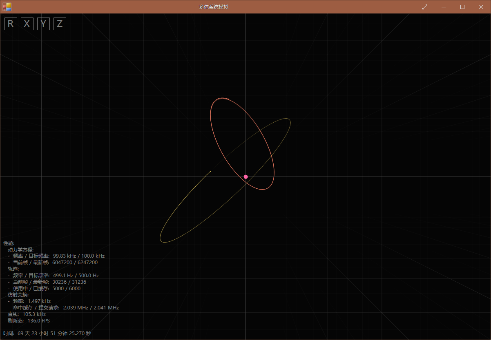

# 多体系统模拟 / Multibody System Simulation
基于Com的多体系统动力学与运动学仿真程序 / A dynamics and kinematics simulation app of multibody system based on Com.

### 许可 / License
多体系统模拟基于[GPLv3](Multibody/LicenseInfo/GPLv3.txt)发布 / Multibody System Simulation is released under [GPLv3](Multibody/LicenseInfo/GPLv3.txt).

